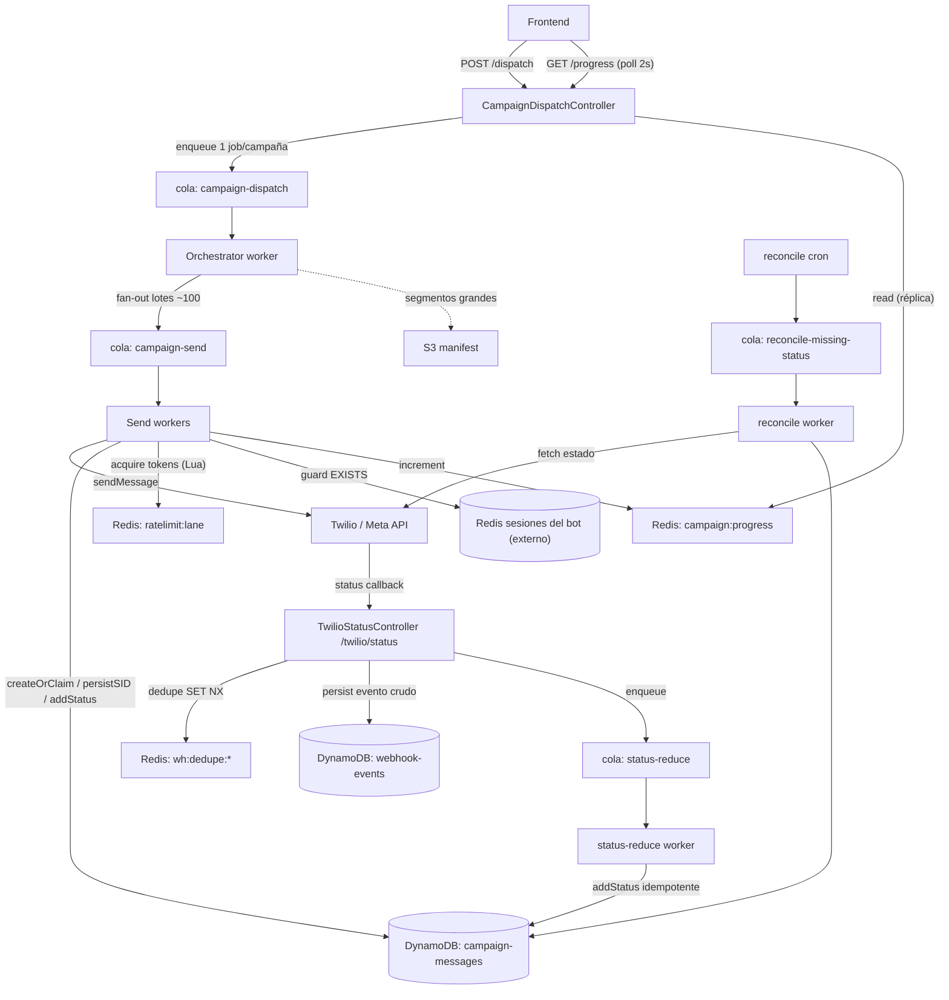
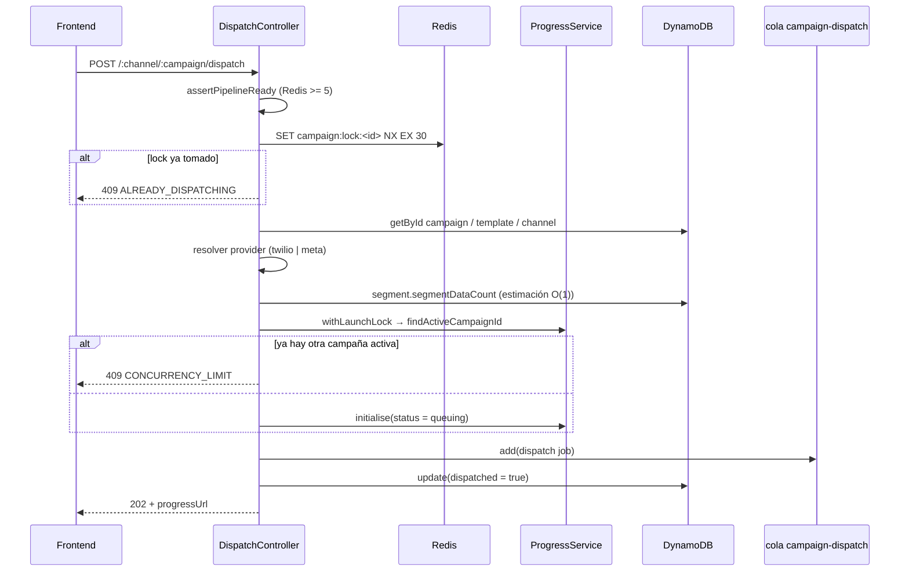
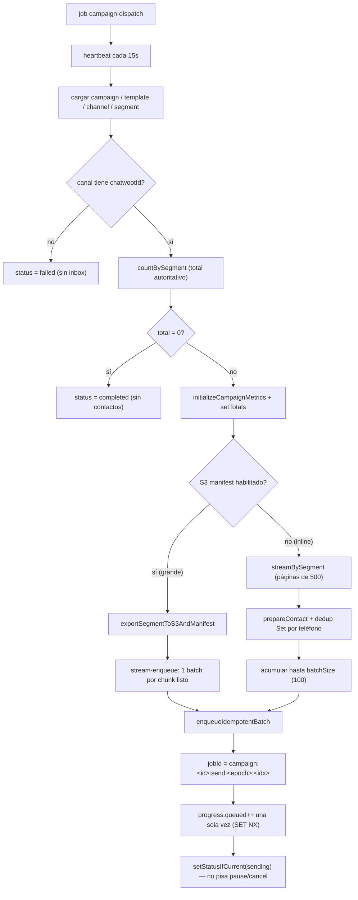
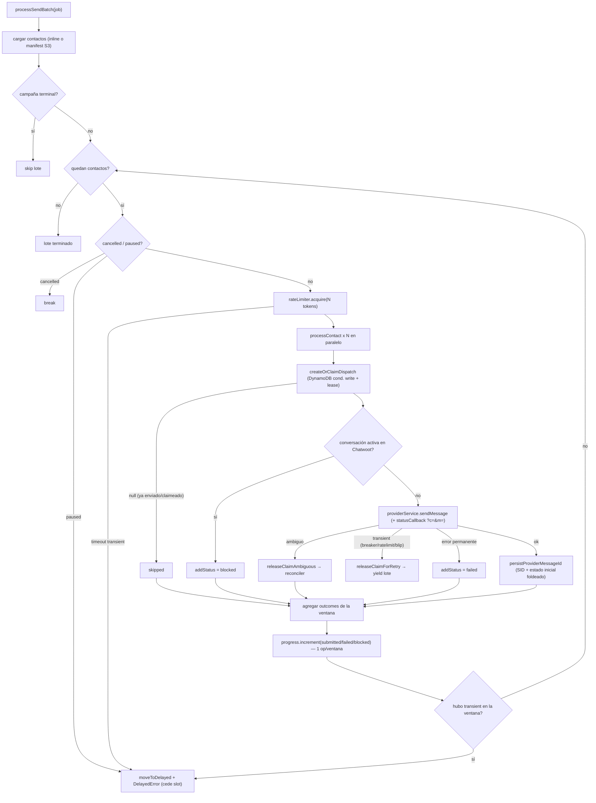
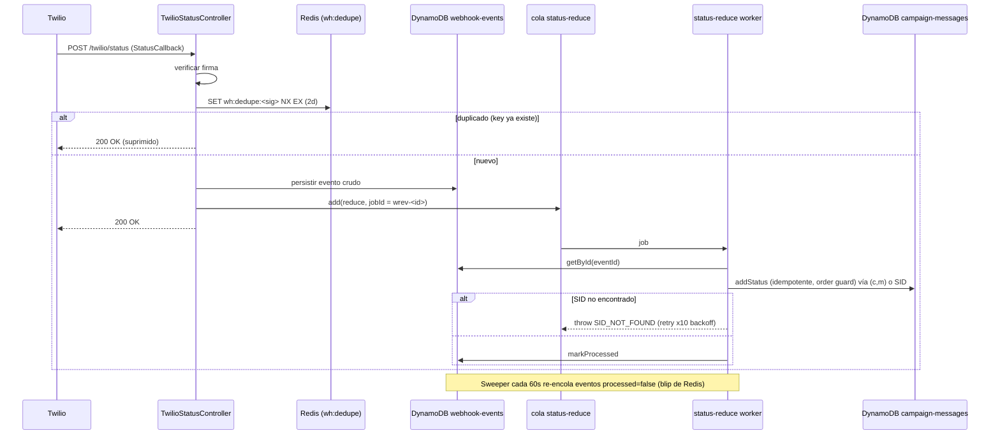
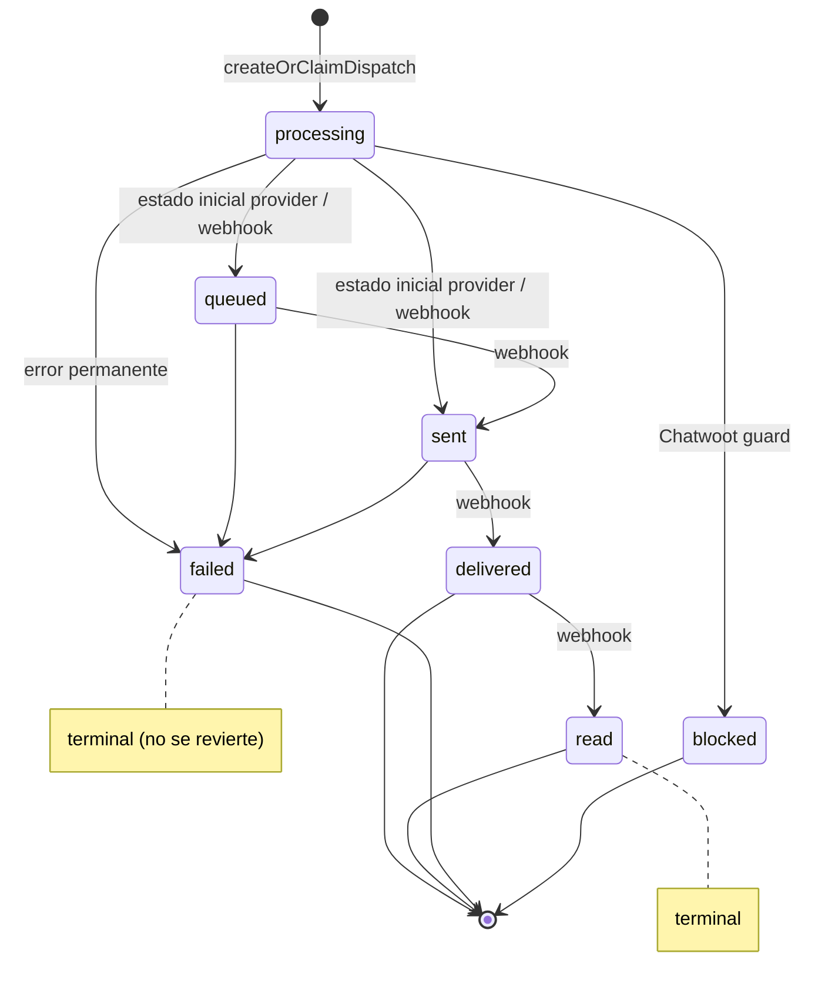
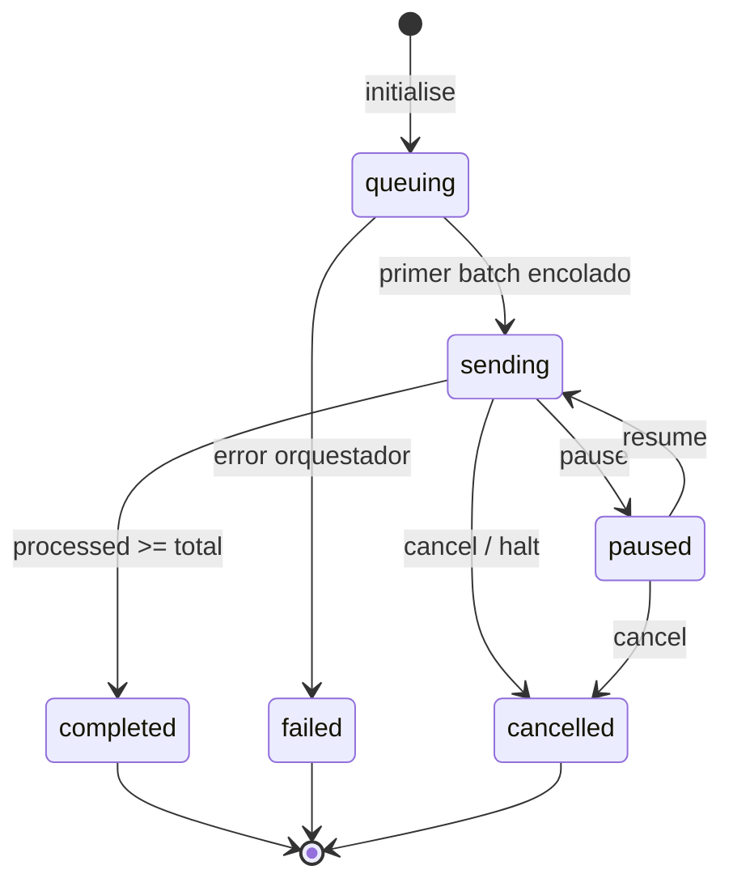
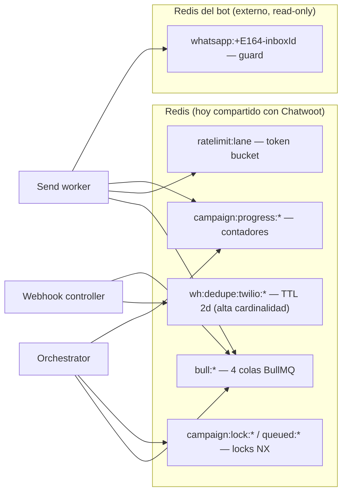

# Pipeline de campañas — flujo del código actual

**Fecha:** 2026-06-29 · Diagramas del comportamiento **actual** (BullMQ + Redis + DynamoDB).
Abrir con el preview de Markdown de VSCode para ver los diagramas Mermaid renderizados.

---

## 1. Vista general del sistema

Cómo se conectan los componentes, colas y stores.

---

## 2. Disparo (HTTP → 202)

`CampaignDispatchController.dispatch` — valida barato y responde rápido; no toca el
segmento real ni envía nada.

---

## 3. Orquestador (worker de `campaign-dispatch`)

1 job = 1 campaña. Cuenta el total autoritativo y hace el **fan-out** en lotes. No envía.

---

## 4. Send worker (worker de `campaign-send`)

1 job = 1 lote de ~100 contactos. Procesa por **ventanas de concurrencia** paceadas por
el token bucket. Acá ocurre el envío real y toda la idempotencia.

Notas clave:
- **Idempotencia:** ID de fila determinístico (`deterministicCampaignMessageId(campaignId, phone)`)
  + `createOrClaimDispatch` con lease → un re-run de BullMQ skipea lo ya enviado.
- **Lease heartbeat:** renueva el claim cada 20s mientras el envío está en vuelo; si se
  pierde, el resultado se trata como ambiguo (ni retry ni failed).
- **Errores transient ≠ failed:** no queman al contacto; liberan el claim y re-encolan el lote.

---

## 5. Ingesta de webhooks + reducción de estado

Persist-first: el controller persiste y encola; el worker reduce el estado.

---

## 6. Máquina de estados del MENSAJE

`addStatus` aplica concurrencia optimista + **order guard**: nunca baja de un estado
terminal o superior (un `sent` tardío no pisa un `delivered`).

---

## 7. Máquina de estados de la CAMPAÑA (progress)

---

## 8. Mapa de uso de Redis (estado actual)

Dónde pega cada cosa durante un disparo — el contexto del incidente.

> Referencias de código: `campaign-dispatch.controller.ts`, `campaign-dispatch.worker.ts`,
> `campaign-send.worker.ts`, `status-reduce.worker.ts`, `rate-limiter.service.ts`,
> `webhookEvents.model.ts`, `config/queue.config.ts`, `config/redis.config.ts`.
