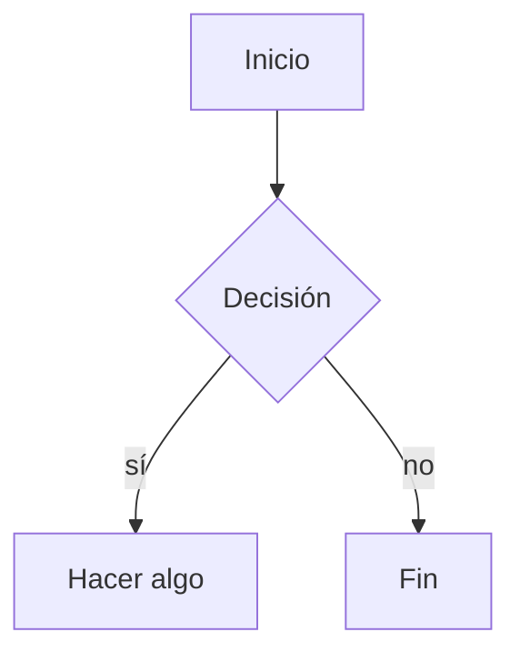

# md2pdf — Markdown a PDF bonito

Convierte archivos Markdown a PDF con calidad real usando el **motor de Chrome/Edge**, sin las fallas típicas de los conversores online: **no corta tablas, no parte filas por la mitad y no desborda URLs ni código largo**.

Genera un PDF con:

- 📄 Portada con el título del documento
- 🗂️ Índice (tabla de contenidos) automático en 2 columnas
- 📊 Tablas con estilo, encabezado que se repite en cada página y filas que nunca se parten
- 📈 **Diagramas Mermaid** (`flowchart`, `sequenceDiagram`, `stateDiagram`, etc.) dibujados de verdad, no como texto
- 🎨 Resaltado de sintaxis en bloques de código
- 💬 Callouts con estilo para las citas (`>`)
- 🌙 Tema claro u oscuro

---

## Requisitos

- **Node.js** 18 o superior
- **Google Chrome** o **Microsoft Edge** instalado (cualquiera de los dos; en Windows Edge ya viene preinstalado)

No se descarga ningún navegador adicional: reutiliza el Chrome/Edge que ya tenés.

---

## Instalación

```powershell
npm install
```

Esto instala las dependencias (`markdown-it`, `markdown-it-anchor`, `highlight.js`).

---

## Uso con interfaz gráfica (UI)

### Opción más fácil: doble clic

Hacé **doble clic en `Iniciar md2pdf.bat`**. Eso:

1. Instala las dependencias la primera vez (si hace falta).
2. Levanta el servidor en un puerto libre.
3. Abre la interfaz en el navegador automáticamente.

Para cerrar el programa, cerrá la ventana negra de la consola.

### Alternativa por terminal

```powershell
npm run ui
```

En cualquier caso, la interfaz se abre sola. Desde ahí podés:

- **📄 Archivo:** arrastrar un `.md` (o soltar texto Markdown directamente)
- **📝 Pegar texto:** pegar el Markdown crudo en un cuadro de texto, sin necesidad de tener un archivo (con nombre de salida opcional)
- Elegir tema claro/oscuro, índice y orientación horizontal
- **Previsualizar** el PDF en pantalla y **descargarlo** con un clic

El servidor busca un puerto libre solo (arranca en el 4321; si está ocupado, prueba el siguiente). Para forzar uno: `node server.js 8080`.

---

## Uso por línea de comandos (CLI)

```powershell
node convert.js <archivo.md> [salida.pdf] [opciones]
```

### Ejemplos

```powershell
# Genera BSUID_MIGRATION_PLAN.pdf junto al .md
node convert.js BSUID_MIGRATION_PLAN.md

# Nombre de salida personalizado
node convert.js doc.md informe-final.pdf

# Página horizontal (ideal para tablas muy anchas)
node convert.js doc.md --landscape

# Tema oscuro
node convert.js doc.md --theme=dark

# Sin índice
node convert.js doc.md --no-toc

# Conservar el HTML intermedio (para depurar el estilo)
node convert.js doc.md --keep-html
```

### Opciones

| Opción            | Descripción                                                        |
| ----------------- | ------------------------------------------------------------------ |
| `--landscape`     | Página horizontal (A4). Útil para tablas muy anchas.               |
| `--theme=light`   | Tema claro (por defecto).                                          |
| `--theme=dark`    | Tema oscuro.                                                       |
| `--no-toc`        | No genera la tabla de contenidos.                                  |
| `--keep-html`     | Conserva el `.html` intermedio junto al PDF.                       |

Si no se pasa un nombre de salida, el PDF se crea junto al `.md` con el mismo nombre.

---

## Por qué no rompe las tablas

Los conversores online suelen aproximar el render con una librería propia. Este usa el motor de Chrome/Edge con CSS de impresión afinado:

- `thead { display: table-header-group }` → el encabezado de la tabla **se repite** en cada página cuando la tabla ocupa varias hojas.
- `tr { break-inside: avoid }` → **una fila nunca se parte** entre dos páginas.
- `overflow-wrap: anywhere` en las celdas → las URLs y el código largo **envuelven** en lugar de desbordar o cortarse.
- Las tablas pueden fluir a varias páginas (`break-inside: auto`) en vez de recortarse al final de la hoja.

Si una tabla sigue quedando apretada en vertical, generá esa versión con `--landscape`.

---

## Diagramas Mermaid

Los bloques de código con lenguaje `mermaid` se **dibujan como diagramas** (no se imprimen como texto):

~~~markdown

~~~

Soporta `flowchart`, `sequenceDiagram`, `stateDiagram-v2`, etc. El renderizado es **determinístico**: el conversor espera a que cada diagrama termine de dibujarse antes de imprimir, así nunca salen cortados ni a medio renderizar. El tema del diagrama (claro/oscuro) sigue al tema del documento.

> **Tip para diagramas anchos:** si un diagrama tiene muchos nodos, en vertical se achica para entrar en la hoja. Usá la opción **horizontal** (`--landscape` / el toggle en la UI) para que se vea más grande.

---

## Cómo funciona

1. Lee el Markdown y lo convierte a HTML con [`markdown-it`](https://github.com/markdown-it/markdown-it) (soporte de tablas GFM, links automáticos, tipografía).
2. Agrega anclas a los títulos y construye el índice con [`markdown-it-anchor`](https://github.com/valeriangalliat/markdown-it-anchor).
3. Resalta el código con [`highlight.js`](https://highlightjs.org/) y prepara los bloques `mermaid` como contenedores de diagrama.
4. Inyecta un CSS de impresión (portada, índice, tablas, código, callouts, diagramas).
5. Renderiza a PDF manejando el Chrome/Edge instalado con [`puppeteer-core`](https://pptr.dev/) (sin descargar ningún navegador): dibuja los diagramas Mermaid, espera a que terminen y recién ahí imprime.

El navegador se detecta automáticamente. Para forzar una ruta específica, definí la variable de entorno `CHROME_PATH`:

```powershell
$env:CHROME_PATH = "C:\Program Files\Google\Chrome\Application\chrome.exe"
node convert.js doc.md
```

---

## Estructura del proyecto

```
md-to-pdf/
├── Iniciar md2pdf.bat  # Doble clic para abrir la UI (Windows)
├── convert.js          # CLI
├── server.js           # Servidor de la UI web (sin dependencias extra)
├── lib/
│   └── render.js       # Núcleo de conversión (compartido por CLI y UI)
├── public/
│   └── index.html      # Interfaz web
├── package.json        # Dependencias y scripts
├── README.md           # Este archivo
└── node_modules/       # Dependencias instaladas
```

Scripts disponibles:

| Comando            | Acción                              |
| ------------------ | ----------------------------------- |
| `npm run ui`       | Levanta la interfaz web (puerto 3000) |
| `npm run convert`  | Atajo del CLI (`node convert.js`)   |

---

## Notas

- Funciona con cualquier `.md`, no solo con el documento de ejemplo.
- El tamaño de página es A4. Para cambiarlo, ajustá la regla `@page` en `convert.js`.
- El HTML intermedio se borra automáticamente salvo que uses `--keep-html`.
