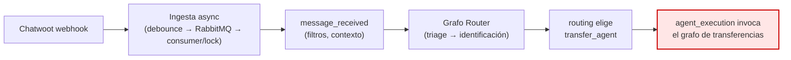
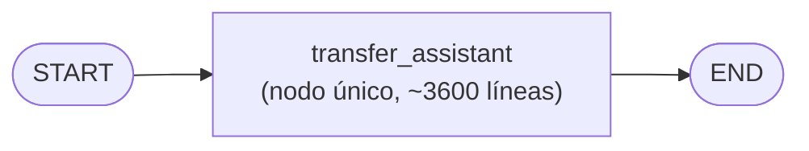
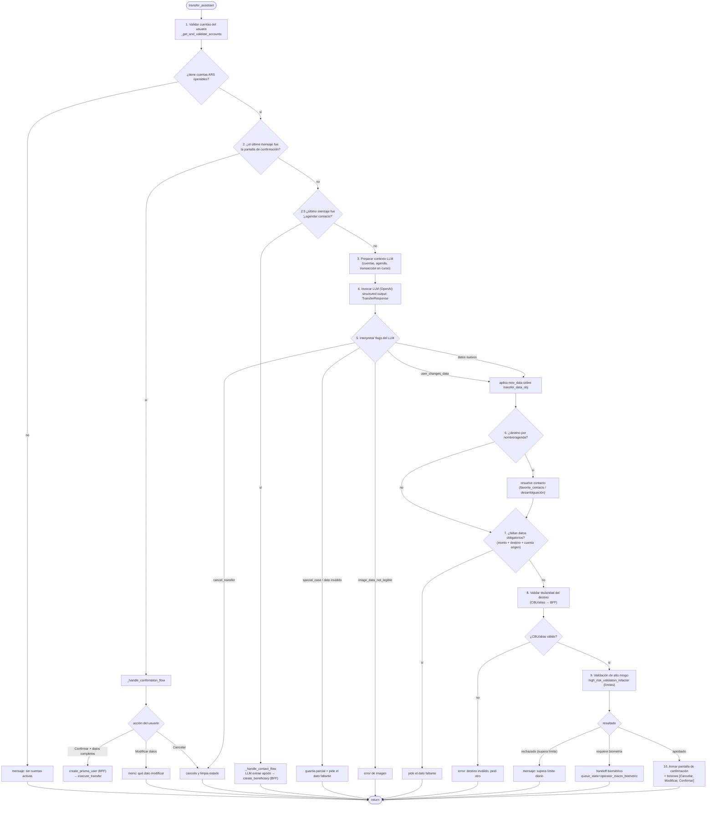
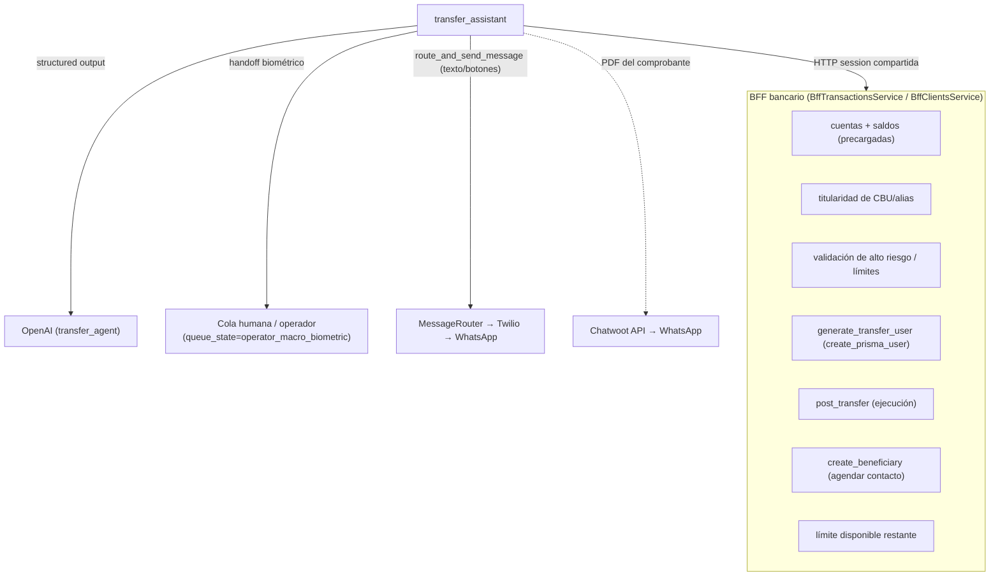

# Agente de Transferencias — Flujo de ejecución completo

> Ejemplo de ejecución **end-to-end de un agente concreto**, desde que ingresa el mensaje del
> usuario hasta que la transferencia se ejecuta y se envía el comprobante. Pensado para mostrar a
> Banco Macro el flujo real de un agente transaccional.
>
> Para las capas previas (ingesta, routing, cómo se llega al agente) ver:
> [`AGENT_PROCESSING_INTERNALS.md`](AGENT_PROCESSING_INTERNALS.md) y
> [`MESSAGE_PROCESSING_FULL.md`](MESSAGE_PROCESSING_FULL.md).
>
> Código: `app/graphs/transacctions/transfer_graph.py`, `app/nodes/transacctions/transfer_nodes.py`.
> Refleja el estado a 2026-07-03.

## Tabla de contenidos

1. [Contexto: cómo se llega al agente](#1-contexto)
2. [Estructura del grafo](#2-estructura-del-grafo)
3. [Flujo interno del nodo `transfer_assistant`](#3-flujo-interno)
4. [Fases del proceso](#4-fases-del-proceso)
5. [Secuencia completa — camino feliz](#5-secuencia-completa)
6. [Servicios externos que consume](#6-servicios-externos)
7. [Casos especiales y ramas](#7-casos-especiales-y-ramas)
8. [Referencias de código](#8-referencias-de-código)

---

## 1. Contexto

Antes de llegar al agente de transferencias, el mensaje ya pasó por:



El `routing` decide que la intención es "transferir" y que el usuario ya está identificado (las
transferencias son un **agente transaccional**: exige identificación previa). A partir de acá
empieza este documento.

---

## 2. Estructura del grafo

El grafo de transferencias es deliberadamente simple: **un solo nodo** que concentra toda la
lógica conversacional y de negocio (`create_transfer_graph`, `transfer_graph.py`).



La complejidad no está en la topología del grafo sino **dentro** del nodo: es una máquina de estados
conversacional que se re-invoca en cada turno del usuario, recuperando el estado desde
`user.data['transfer_data_obj']` (los datos de la transferencia en curso). No hay `ToolNode`: el
nodo llama a los servicios (BFF) directamente y usa el LLM solo para **extraer datos estructurados**
del mensaje.

---

## 3. Flujo interno

Cada vez que el usuario manda un mensaje mientras está en el agente, se ejecuta `transfer_assistant`
de arriba a abajo. El orden importa: primero resuelve flujos de *continuación* (confirmación,
contacto), y solo si no aplican, corre el LLM para interpretar un mensaje nuevo.



---

## 4. Fases del proceso

| # | Fase | Qué hace | Sistema |
|---|---|---|---|
| 1 | **Validar cuentas** | Lee `user.data['accounts']` (precargadas de BFF), filtra cuentas en pesos operables. Sin cuentas → corta. | Redis/BFF (cache) |
| 2 | **Flujo de confirmación** | Si el turno anterior fue la pantalla de confirmación, interpreta `Confirmar` / `Modificar datos` / `Cancelar` (botón o lenguaje natural vía LLM). | OpenAI |
| 2.5 | **Flujo de contacto** | Si se ofreció agendar al destinatario, extrae el apodo y crea el beneficiario. | OpenAI + BFF |
| 3 | **Contexto LLM** | Arma cuentas propias, agenda (`favorite_contacts`), transacción en curso, cuenta pre-seleccionada. | — |
| 4 | **Extracción LLM** | Un `ChatOpenAI` con **structured output** (`TransferResponse`) interpreta el mensaje y devuelve monto, alias/CBU, cuenta origen, concepto, referencia, resolución de contacto y ~25 flags de control. | OpenAI |
| 5-7 | **Ramas y completitud** | Resuelve cancelación, casos especiales, modificación de datos, resolución de contacto de agenda; si faltan datos obligatorios, los pide. | OpenAI/BFF |
| 8 | **Titularidad del destino** | Valida el CBU/alias contra BFF y obtiene titular + banco. Si es inválido, pide otro. | BFF |
| 9 | **Alto riesgo / límites** | `high_risk_validation_refactor` para `TRANSFERENCIAS`: aprueba, rechaza por límite, o **deriva a validación biométrica** (handoff a humano/operador). | BFF + cola |
| 10 | **Confirmación** | Arma el resumen y lo envía con botones `[Cancelar, Modificar datos, Confirmar]`. | Chatwoot |
| — | **Ejecución** | Al confirmar: `create_prisma_user` + `post_transfer` (BFF), incrementa uso de CBU, envía comprobante PDF, informa límite restante y ofrece agendar el contacto. | BFF + Chatwoot |

---

## 5. Secuencia completa

Camino feliz: el usuario manda "transferí 5000 a alias.ejemplo por el alquiler" y luego confirma.
Son **dos turnos** (dos ejecuciones del nodo), porque el bot espera la confirmación explícita.

```mermaid
sequenceDiagram
    autonumber
    participant U as Usuario (WhatsApp)
    participant TA as transfer_assistant
    participant LLM as OpenAI (TransferResponse)
    participant BFF as BFF bancario
    participant Q as Cola humana (biometría)
    participant CW as MessageRouter (→ Twilio)

    Note over TA,CW: respuestas (texto/botones) van directo a Twilio;<br/>el PDF del comprobante va vía Chatwoot (ver MESSAGE_PROCESSING_FULL §9)

    Note over U,CW: TURNO 1 — carga de datos y confirmación
    U->>TA: "transferí 5000 a alias.ejemplo por el alquiler"
    TA->>BFF: valida cuentas del usuario (cache)
    TA->>LLM: extrae datos (structured output)
    LLM-->>TA: amount=5000, alias=alias.ejemplo, reason=Alquileres, origin=cuenta favorita
    TA->>BFF: valida titularidad del destino (alias → titular + banco)
    BFF-->>TA: titular "Juan Pérez", Banco X
    TA->>BFF: validación de alto riesgo (límite diario)
    alt supera umbral → requiere biometría
        BFF-->>TA: handoff_pending
        TA->>Q: deriva a validación biométrica (queue_state=operator_macro_biometric)
        TA->>CW: mensaje al usuario (validación pendiente)
    else aprobado
        BFF-->>TA: aprobado
        TA->>CW: pantalla de confirmación + botones [Cancelar, Modificar, Confirmar]
    end
    CW-->>U: resumen "5000 a Juan Pérez, alquiler. ¿Confirmás?"

    Note over U,CW: TURNO 2 — confirmación y ejecución
    U->>TA: "Confirmar"
    TA->>TA: valida datos completos
    TA->>BFF: create_prisma_user (generate_transfer_user)
    TA->>BFF: post_transfer (ejecuta la transferencia)
    BFF-->>TA: errorCode=0 (éxito) + PDF comprobante
    TA->>CW: "✅ Listo, te adjunto el comprobante" + PDF
    TA->>BFF: consulta límite disponible restante
    TA->>CW: "Podés transferir hasta $X hoy" + "¿Agendar contacto?"
    CW-->>U: comprobante + límite + oferta de agenda
```

---

## 6. Servicios externos



Todas las llamadas a BFF pasan por la **HTTP session compartida** (`http_client.py`: pool + retry).
El LLM (`agent_id="transfer_agent"`) usa su propia config de modelo/temperature desde DynamoDB.

---

## 7. Casos especiales y ramas

El nodo maneja muchas ramas para que la conversación sea robusta:

- **Cancelación** en cualquier momento (`cancel_transfer`): limpia `transfer_data_obj` y despide.
- **Modificar datos** desde la confirmación: menú de qué cambiar (destinatario, monto, cuenta,
  concepto, referencia) → aplica `new_data` sobre la transacción en curso.
- **Transferencia por imagen**: si el usuario manda un comprobante, Vision (en el controller) extrae
  los datos; si la imagen no es legible → `image_data_not_legible`.
- **Resolución de contacto**: si el usuario dice "mandale a mi tío Pablo", el LLM extrae el nombre y
  matchea contra `favorite_contacts`; si hay ambigüedad, desambigua; si no está, pide CBU/alias.
- **Cuenta de origen**: usa cuenta favorita / pre-seleccionada, o muestra un menú si el usuario no
  la indicó o eligió una que no tiene.
- **Validación biométrica**: montos de alto riesgo derivan a un flujo de biometría fuera del bot
  (el `queue_state=operator_macro_biometric` hace que el controller saltee la IA hasta el callback).
- **Concepto/monto inválidos**: normaliza montos ("dos millones" → "2000000"), valida conceptos
  contra la tabla de `REASON_CODES` (default 8 = Varios).

Estas ramas son la razón por la que el nodo es grande: cada una preserva el estado parcial en
`user.data` para no perder datos entre turnos ni ante un handoff.

---

## 8. Referencias de código

| Tema | Archivo:línea |
|---|---|
| Grafo (nodo único) | `app/graphs/transacctions/transfer_graph.py` |
| Nodo principal | `app/nodes/transacctions/transfer_nodes.py:62` (`transfer_assistant`) |
| Validación de cuentas | `transfer_nodes.py:1773` (`_get_and_validate_accounts`) |
| Flujo de confirmación | `transfer_nodes.py:1835` (`_handle_confirmation_flow`) |
| Flujo de agendar contacto | `transfer_nodes.py:1947` (`_handle_contact_flow`) |
| Extracción LLM (schema) | `transfer_nodes.py:208` (`TransferResponse`, `agent_id="transfer_agent"`) |
| Validación de alto riesgo | `transfer_nodes.py:2645` (`high_risk_validation_refactor`) |
| Ejecución de la transferencia | `transfer_nodes.py:2864` (`execute_transfer` → `post_transfer`) |
| Generación de usuario Prisma | `transfer_nodes.py:3587` (`create_prisma_user` → `generate_transfer_user`) |
| Servicio de transacciones | `app/services/bff_service_transactions.py` (`BffTransactionsService`) |
| Comprobante PDF | `app/utils/generate_pdf.py` (`decode_pdf_transfer`) |
